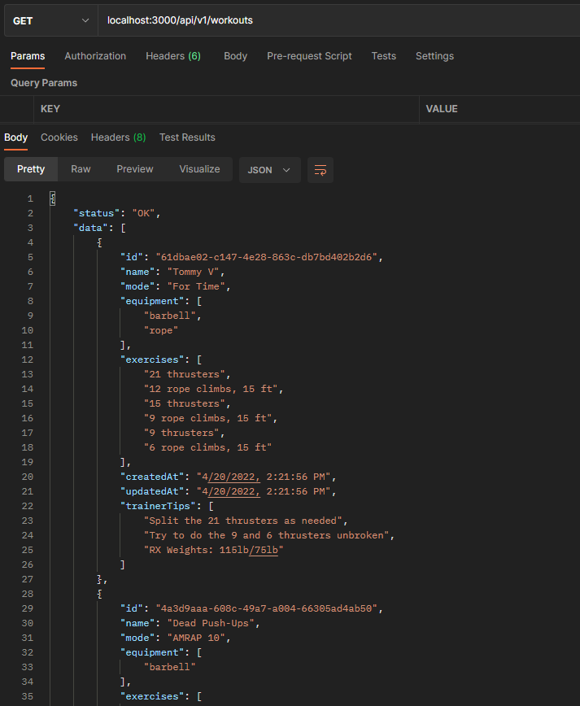
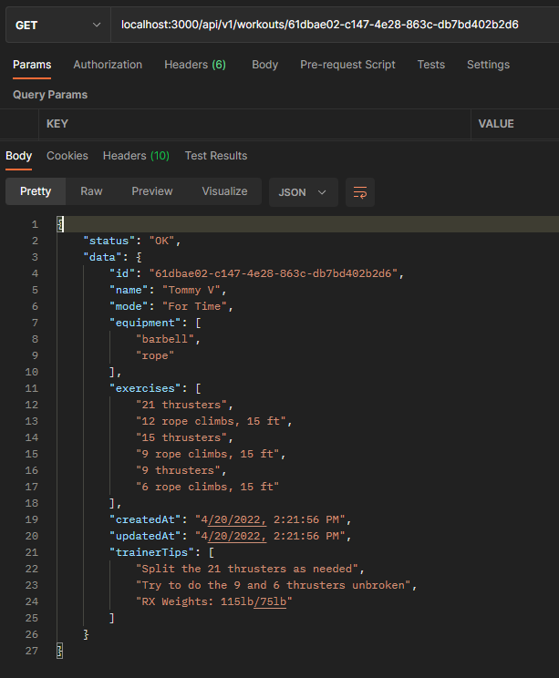
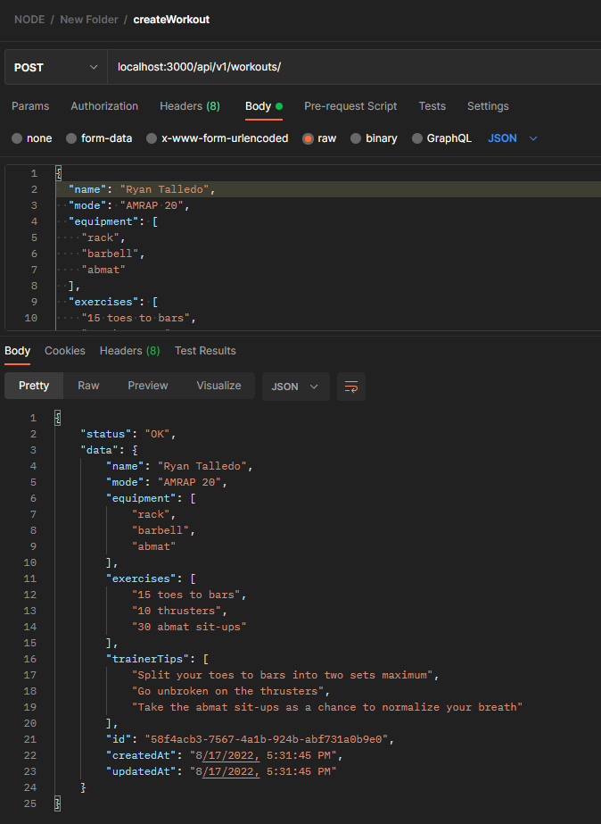

# Workouts API - Node
Esta api es de una guia de una guia de [freeCodeCamp](https://www.freecodecamp.org/news/rest-api-design-best-practices-build-a-rest-api/). Lo cual nos enseña a crear una API con buenas prácticas.git.

